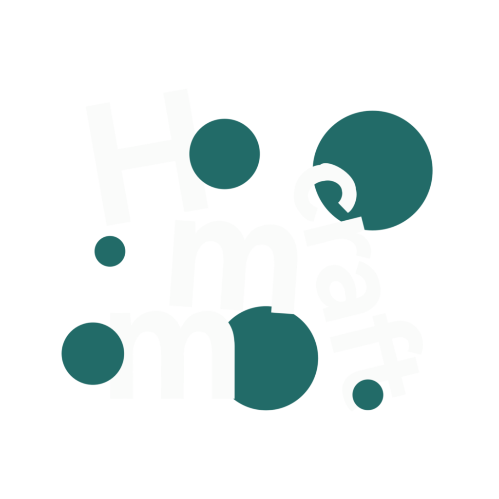

<p align="center">
  
</p>

<h1 align="center">Harmomeow Craft Launcher</h1>

<p align="center">
  <b>Harmo</b>nyOS + <b>meow</b> —— 在鸿蒙 PC 上原生运行 <b>Minecraft: Java Edition</b> 的启动器。<br/>
  <b>全流程在鸿蒙 PC 上编译并运行</b>
</p>

<p align="center"><em>HarmonyOS 2in1（PC） · ArkTS + 自研 C/C++ 桥 · Minecraft 1.6.x – 26.3</em></p>

<p align="center"><b>中文</b> | <a href="README.md">English</a></p>

---

Harmomeow Craft Launcher 面向**鸿蒙（HarmonyOS）PC**：不依赖 Android 兼容层、不修改 Minecraft，而是用 **ArkTS + 自研 native 桥**把 Minecraft 的窗口 / 输入 / 渲染 / 音频接到鸿蒙原生能力（OHNativeWindow / EGL / 输入环 / OHAudio）上。全程**透明可控**。

---

# 第一部分 · 用户手册

## 支持的游戏版本

**Minecraft: Java Edition 1.6.x – 26.3**
（实机验证：1.6.1 / 1.6.4 / 1.7.10 / 1.8.9 / 1.12.2 / 1.16.5 / 1.21.10 / 26.1.2 / 26.2 / 26.3-rc-1 均可玩）

| 版本段 | 渲染路径 | 状态 |
|---|---|---|
| 1.6.x – 1.12.2 | 自编 LWJGL2 + gl4es（GLES） | ✅ |
| 1.13 – 1.16.x | LWJGL3 + gl4es（GLES） | ✅ |
| 1.17 – 1.21.x | LWJGL 3.3.3 + 系统桌面 GL（Zink） | ✅ |
| ≥ 1.22（26.x） | LWJGL 3.4.3 | ✅ |
| ≥ 26.3 | 自编 SDL3 + `ohos` 驱动 | ✅ |

## 功能

**游戏目录**
- 添加多个 `.minecraft` 目录并支持设置昵称；可以自由选择。

**版本管理**
- **在线下载 / 安装原版**任意版本（BMCLAPI／官方源切换、正式版/快照/其他过滤）。
- **逐版本「版本隔离」**开关：存档 / 选项 / 日志落版本目录，与其它版本互不干扰（与 HMCL / PCL 同构，所以 `.minecraft` 目录互相兼容！）。
- 逐版本**渲染后端**选择（根据版本推荐 / 桌面 OpenGL / GL4ES(兼容)）。

**账户**
- **离线账户**：多账户、UUID 等信息即时展示。
- **微软正版登录**：OAuth2 **设备码流程**（登录 / 自动续期 / 手动刷新 / 退出登录）；需要自己准备有效的微软 Azure client id（AppID）。

**游戏**
- 独立游戏窗口 & 独立进程，允许在游戏打开后关闭启动器。
- **全屏**（F11 / 视频设置）。
- **显示缩放**：渲染分辨率 = 窗口 / N（N = 1x/1.5x/2x/3x/4x），低分渲染 + 上采样，降低高 DPI 屏的渲染压力（拯救一下麒麟 & 马良 GPU (￣ω￣;)）。
- 内置 JRE 一键解压；将某些 OpenSL ES 淘汰掉，走鸿蒙 **OHAudio**（低延迟）。

**高级选项**：鼠标采样率 overlay、CPU 线程数、最大内存、滚轮速度、显示缩放、微软 client_id 等等。

## 已知限制

- **刷新率档位**：帧率上限 = 系统显示档位（"动态"=60 / "高"=90），应用侧**无法**强制 90。
- **鼠标抓取采样 = 显示帧率**：grab（鼠标锁定）时鼠标采样与 UI 帧率同步；非 grab 走原生约 500Hz 绝对坐标直通（跟手一些）。
- **物理键盘 F 键**：F 行为可能会有一些问题，我们已经尽力优化 🤪。
- **MC ≥ 26.2 的原生 Vulkan 后端不可用**：KirinX90 的 Vulkan 驱动缺少 MC 所需的某些扩展。
- **1.16.5 首屏无文字** 这个真的不知道为什么了，非常诡异。
- 平台 `libGLv4` 为 **Mesa Zink**（GL-on-Vulkan），偶发 20–70ms 尖刺，非应用层可解。
- 更老（1.4.x / 1.5.x）未验证，**不在**支持窗口。

## 获取与安装

> 目前**未上架应用商店**。可自行构建（见第二部分）。

> **设备要求**：HarmonyOS **2-in-1（PC）**，API ≥ 23（实机 API 26 / 7.0.0）。需要本机已安装的 Minecraft Java 版或**在线下载**；使用**微软登录**时需自备 Azure client_id（见开发侧）。

---

# 第二部分 · 开发者手册

## 定位

**突发奇想并试验性的、在市售版鸿蒙 PC 上编译并运行的 Minecraft Java 版启动器（？！一拍脑袋！？）**——把 Minecraft 的 GLFW / SDL 窗口、输入、GL、OpenAL 音频接到鸿蒙原生能力（OHNativeWindow / EGL / SPSC 输入环 / OHAudio）上，且**全链透明可控**。

## 架构总览

```
ArkTS (entry HAP)                       :game 进程（独立 UIAbility / 进程）
 ├ 目录 / 版本 / 账户 / 下载 / 设置 UI
 └ GameWindow ─ XComponent(surface)
        │  setGameSurface / launchJvm
        ▼
 libmeowjrebridge.so (meowcraftlib)     NAPI：launchJvm / surface / send_* / 光标锁
        │  dlopen(RTLD_GLOBAL)
        ▼
 libmeowcraftbridge.so                  净室桥：EGL/GLCapabilities + SPSC 输入环 + 窗口/resize/grab
        ▲
        │  dlsym / 输入环 / meow_environ 共享块
 liblwjgl*.so / libSDL3.so              平台绑定（GLFW 语义 / SDL3 ohos 驱动）
        ▼
 JVM（内置 JRE）→ meow.launcher（净室）→ Minecraft
```

- **Java 侧**：官方 LWJGL 模块 + 自研**净室 overlay**（GLFW / CallbackBridge / GLCapabilities / RendererInit）。
- **native 侧**：净室 `libmeowcraftbridge.so`（提供全部 `glfw*` 语义）、`libmeowjrebridge.so`（NAPI / `JLI_Launch`）、`libmeowassets.so`（JRE 解压）。
- **启动链路**：`meow.launcher` 负责 classpath staging、账户、argv、`JLI_Launch`。

## 平台与工具链

- **目标平台**：HarmonyOS 2-in-1，`targetSdkVersion = 6.1.0(23)`，`deviceTypes = ["2in1"]`；实机 **MateBook Fold（Kirin X90）**。
- **构建工具链**：**DevEco Studio / DevEco Code** 及其命令行 **`devecocli`**。本项目**绝大多数产物都由它构建**——HAP / HSP / HAR、带 native 的 CMake/NDK 交叉编译、签名、部署、设备管理与静态检查。OHOS SDK 位于 `$HOME/devecow/deveco_tools/sdk/default/openharmony`。

## 本机环境（开发机 = 运行机）

- **设备**：HUAWEI MateBook Fold（2-in-1 PC，ARM aarch64，CPU **Kirin X90**）
- **系统**：**HarmonyOS 7.0.0.105 (SP12C00E100R12P5logpatch09)**
- **IDE / 工具链**：**DevEco Code 0.3.4**（及命令行 `devecocli`）
- **SDK**：`targetSdkVersion / compatibleSdkVersion = 6.1.0(23)`，`modelVersion 6.1.0`；SDK 路径 `$HOME/devecow/deveco_tools/sdk/default/openharmony`
- **作业方式**：开发全程使用 **DeepSeek V4 Flash + DeepSeek V4.1 Flash**（AI 辅助）
- **备注**：在 HarmonyOS 7.0.0.105 上，hiShell 内的 DevEco Code **尚不能正常使用 JVM** → 所有 `javac` 由人在有 JDK 的 shell 中手动执行。

## 依赖

| 组件 | 版本 | 许可 | 随包 | 说明 |
|---|---|---|---|---|
| OpenJDK / JRE | 25（OHOS aarch64-musl） | GPL-2.0 + Classpath-Exception | ✅ | 运行时；唯一外部预编译件 |
| LWJGL | 3.3.3 / 3.4.3 / 2.9.3 | BSD-3 | ✅ | **三代并存**，按 MC 版本选代 |
| OpenAL Soft | 1.24.3 | LGPL-2.0+ | ✅ | OHAudio 后端 |
| FreeType | 2.13.3 | FTL | ✅ | 字体渲染 |
| SDL3 | `release-3.4.14`（fork） | Zlib | ✅ | MC ≥ 26.3 平台绑定 |
| shaderc / SPIRV-Cross | 按 LWJGL 3.4.3 钉版 | Apache-2.0 | ✅ | MC ≥ 26.3 `renderpearl` |
| gl4es | v1.1.7 | MIT | ✅ | ≤ 1.16 / legacy 固定管线翻译层 |
| libffi | 3.8.0 | MIT | （链接进 lwjgl） | LWJGL ≥ 3.4 依赖 |
| oshi | 5.7–6.9 + 1.1 | MIT | ✅ | CPU 信息补丁 |
| gson | 2.13.1 | Apache-2.0 | ✅ | launcher 专用（shade 到 `meow.gson`） |

> 完整第三方声明： [`THIRD-PARTY-NOTICES.md`](THIRD-PARTY-NOTICES.md)；许可全文： [`LICENSES/`](LICENSES/)；源码要约： [`SOURCE-OFFER.md`](SOURCE-OFFER.md)。

## 构建指南

**App 本体**：用 **DevEco** 打开本工程 → `devecocli build`（或 IDE Build）。**签名材料不入库**——请在 DevEco「Project Structure → Signing Configs → 自动签名」本地生成。

**自编随包件（`tools/`）**：所有自编 / 魔改的第三方件都固化在 [`tools/`](tools/)，**路径全参数化、可脱离本工程复用、以 100% 可复现为目标**：

| 工具 | 产物 |
|---|---|
| [`tools/lwjgl/`](tools/lwjgl/) | LWJGL 两代 jar + 6 native + `libffi` + extras 组包 |
| [`tools/lwjgl2/`](tools/lwjgl2/) | legacy LWJGL2 `liblwjgl.so`（MC 1.6–1.12） |
| [`tools/openal/`](tools/openal/) [`tools/freetype/`](tools/freetype/) [`tools/gl4es/`](tools/gl4es/) [`tools/sdl/`](tools/sdl/) [`tools/shaderc/`](tools/shaderc/) [`tools/oshi/`](tools/oshi/) [`tools/meow-launcher/`](tools/meow-launcher/) | OpenAL / FreeType / gl4es / SDL3 / shaderc / oshi / 净室 launcher |

- 总索引：[`tools/README.md`](tools/README.md)
- 约定：**`javac` 必须由人在有 JDK 的 shell 执行**（hiShell 中的 DevEco Code 在 HarmonyOS 7.0.0.105 上尚不能正常使用 JVM）；native（CMake / 交叉编译）与 python 打包可脚本化。
- **可复现性**：同 tag + 同 SDK + 同**绝对**构建路径 → **逐字节可复现**（多数产物已 3× 干净重建 + `cmp` 验证）。

## 生产环境

- **运行环境**：一般普通鸿蒙 PC（2-in-1），API ≥ 23。
- **部署顺序**：先装 HAR/HSP（`meowjre25` / `meowcraftlib` / `meowlwjgl3`），再装 `entry` HAP；**改 native 后需清模块 build 再重建 HSP**。

## 许可证

本项目**原创代码采用 MIT**（见 [`LICENSE`](LICENSE)）；随包第三方件保留各自许可（详见 [`THIRD-PARTY-NOTICES.md`](THIRD-PARTY-NOTICES.md)）。

## 非官方声明

非官方性质与商标声明见 [`TRADEMARKS.md`](TRADEMARKS.md)。Minecraft 是 Mojang / Microsoft 的商标；本项目**不分发游戏本体**。
